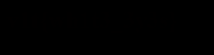

# V1t Duck CTF: Blank 

Author: Walker Dauphin II (obsydian_falcon)

## Description

* Category: Misc
* Sub-category: Steganography

> This image is blank is it?
> 
> Format: v1t{the_flag}

Files:
* [white.png](white.png)

## Tools used

* `exiftool`
* `steghide` (deadend)
* `zsteg` (deadend)
* `strings` (deadend)

## Initial Steps

I opened my terminal and ran exiftool on the provided picture, hoping to discover any useful information but got nothing. After that, I ran the strings command found in Unix systems in order to break down the strings found in the picture's metadata. This also turned out to do nothing.

Thinking there was another tool that could do the job, I tried using steghide and zsteg. Steghide is great for files that may have compressed files *within* them while zsteg is more useful for PNG files specifically. But both these tools turned into dead-ends.

## Solution

After the previous tools failed, I opened the png in my photo editor and played with the **brightness**, **gamma**, and **contrast** values. Nothing happened, but I figured this was a digital version of lemon juice on paper, I just needed to find the right UV light to put it under.

Following this logic, I looked up an article on steganography to see if there were tips on manipulating pictures: [stegonography cheatsheet](https://pequalsnp-team.github.io/cheatsheet/steganography-101). This article proved to be invaluable. Within it I found a python script that would invert the values of all pixels within a given picture.

#### The script in question

```Python
from PIL import Image

if __name__ == '__main__':
    img = Image.open('./white.png')
    
    in_pixels = list(img.getdata())
    out_pixels = list()
    
    for i in range(len(in_pixels)):
        r = in_pixels[i][0]
        g = in_pixels[i][1]
        b = in_pixels[i][2]
        out_pixels.append((255-r, 255-g, 255-b))
    
    out_img = Image.new(img.mode, img.size)
    out_img.putdata(out_pixels)
    out_img.save("output_inverted.png", "PNG")

```

After running this python script, I was able to get a completely inverted png. I opened the photo in my editor and changed the **brightness**, **gamma**, and **contrast** values again.



Turned out, the right values after some experimentation were 100(b), 1(c), and 1(g).

The flag revealed in the picture:

`v1t{whit3_3y3s}`
