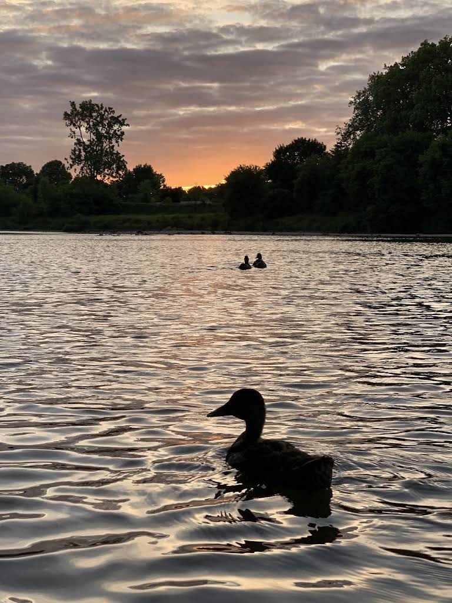
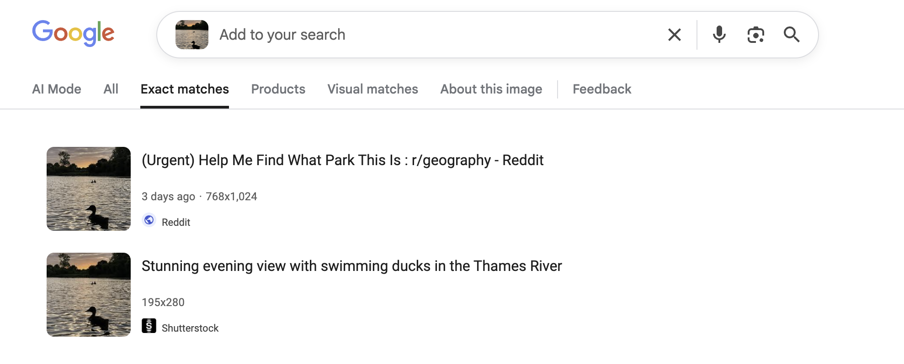
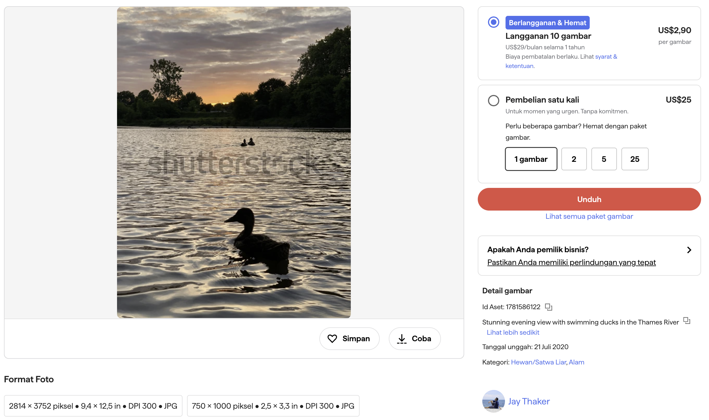
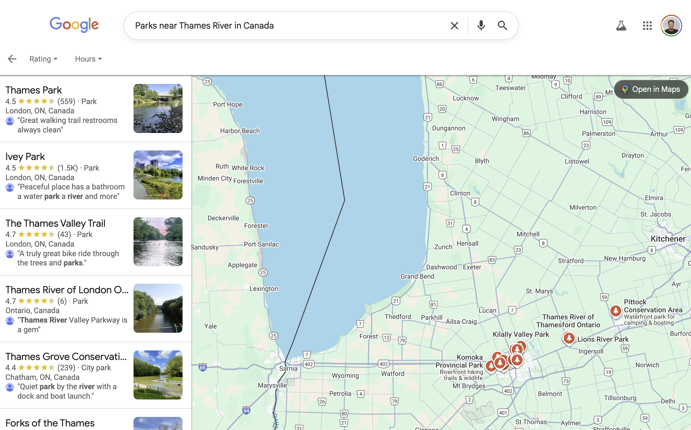

# V1tCTF 2025: Dusk Till Duck

Author: Duck (Duke) Nguyen (duke7012)

## Description

* Challenge author: N/A
* Category: OSINT
* Point value: 100

> As the sun sets over a calm lake, a lone duck drifts across the fading light. The scene looks peaceful, but the park hides more than it seems. Can you figure out where this photo was taken before the night falls?
> 
> Format: v1t{place_name}
> Example: v1t{Abc_Park}

File(s):

## Tools used

* [Google Lens (in Google Search)](https://lens.google/)

## Solution

When encountering an OSINT challenge of finding a place with a given picture, I first reverse-search the image using [Google Lens](https://lens.google/). Go to **Exact matches** to find the source of the image. Never forget our goal is to find _what park is in the picture_.

Ignore the Reddit post (cuz somebody posted this image on Reddit asking for help for the CTF -- which is NOT cool at all...), the only link I found is the [original image post](https://www.shutterstock.com/id/image-photo/stunning-evening-view-swimming-ducks-thames-1781586122?dd_referrer=https%3A%2F%2Fwww.google.com%2F). It is a stock image for sale.

I tried to look at the photographer's [profile](https://www.shutterstock.com/g/Jay+Thaker). It seems like this park is in Canada, since he said that he is based in Canada. He had great photographs, by the way!

However, looking at his other photos, there is no clue about this park, since he travels a lot!. I go back to the picture, look at the info and it says `Stunning evening view with swimming ducks in the Thames River`.

So I started searching for `Parks near Thames River in Canada`...

There are tons of parks along the river. Usually, the park name should not be too long for a CTF, so I try some of the short names first. Luckily, as I reach the second name, it says correct. Quack quack.

Flag: `v1t{Ivey-Park}`

## Rating

_**Like**: It is extremely difficult to brute force in an OSINT challenge. I believe there is a better way to verify the location of the photo, but it is definitely not worth it for an 100-point challenge._
