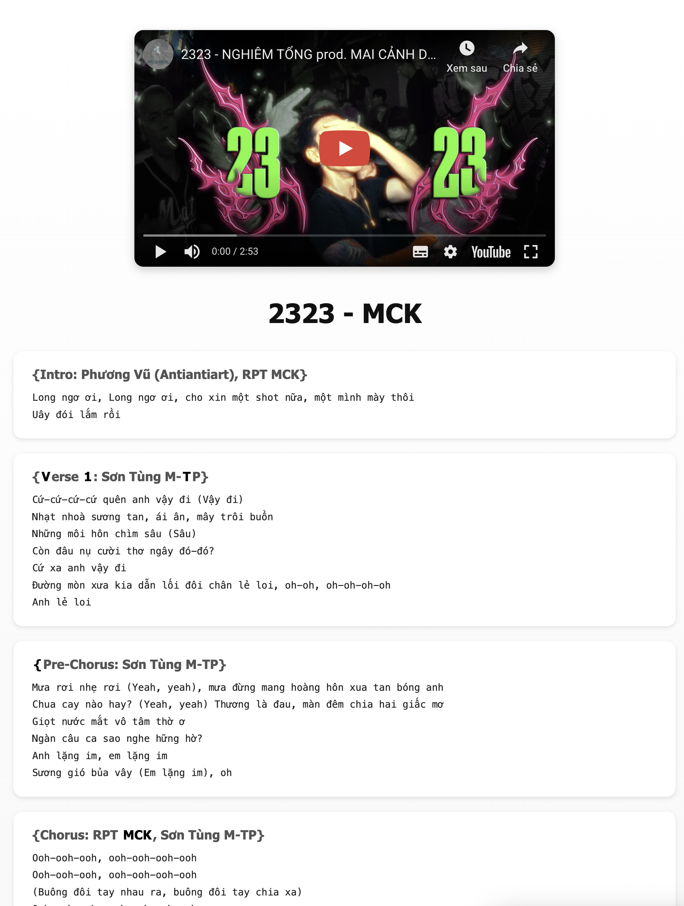
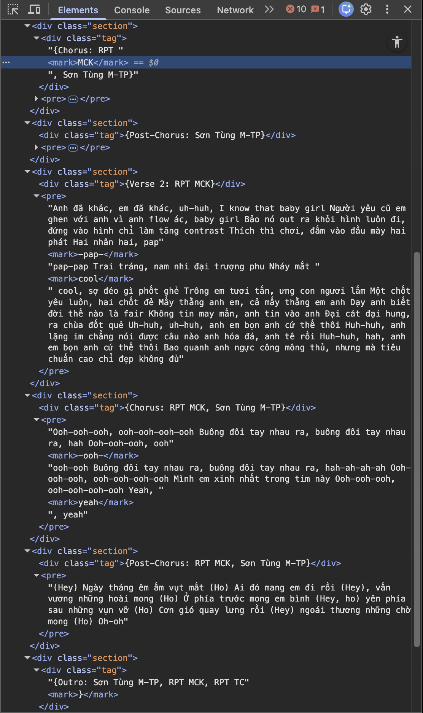

# V1tCTF 2025: Mark The Lyrics

Author: Duck (Duke) Nguyen (duke7012)

## Description

* Challenge author: MCK
* Category: Web
* Point value: 100

## Description

> My friend make a website for his favourite, but the lyrics seem a little bit odd
> 
> http://tommytheduck.github.io/mckey

## Tools used

* Google Chrome
    * _Alternative:_ Any browser with the inspection feature.

## Solution

The website looks very normal, just a webpage displaying the lyrics of a remix music video. I am Vietnamese, so I know where most parts of the lyrics come from. It was really dope, you should listen to it!

Anyway, first thing first, I did not have many experience with Web challenges, so the only first thing I could do is to **Inspect** it!

As I expand the very first line of the lyric, there is something very noticable here. The letter `V`, `1` and `T` are visibly used the `<mark>` tag, which is very suspicious since those are the letters of the flag format.

That's why I decided to unfold all of the lyrics line to find the marked words. I found the following words are using the same tag: `MCK`, `-pap-`, `cool`, `-ooh-`, `yeah` and `}`. It is quite funny because they missed the the opening curly brace, but it is enough for you to recognize that it is our flag.

Quack quack.

Flag: `v1t{MCK-pap-cool-ooh-yeah}`

## Rating

_**Like**: Cool challenge for Web beginner! Also, MCK is a famous rapper in Vietnam, so if you are interested, you can find more songs from him online :D_
