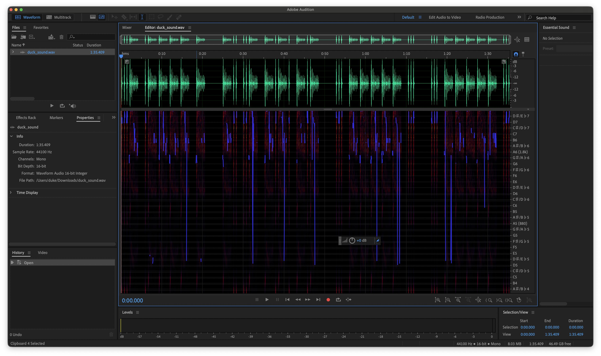
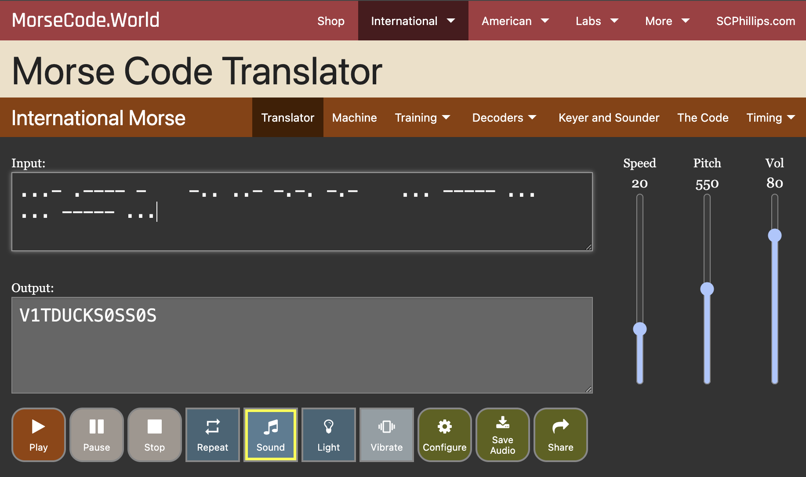

# V1tCTF 2025: Talking Duck

Author: Duck (Duke) Nguyen (duke7012)

## Description

* Challenge author: Rawr
* Category: Misc
* Point value: 100

> Bro this duck is talking to me or something ? I'm high or what ??
> 
> Attachment: https://drive.google.com/file/d/1XOVJwPqHTZBRRUiuve8E1VwBSmMyB4Us/view?usp=sharing

Files:

* [duck_sound.wav](duck_sound.wav)

## Tools used

* Adobe Audition CC 2026 (PC Application)
* [Morse Code Translator (Website)](https://morsecode.world/international/translator.html)
* _Alternative:_ Some other basic sound editing software, such as Audacity.

## Solution

When I first heard the audio, there is only two kinds of duck audio: (1) very short quack, and (2) very long quack. Since this is a 100-point challenge, the technique to solve should not be too complicated. I decided to analyze the file using Adobe Audition first.

As you look at the pattern, there is clearly two types of code: short quacks & long quacks, which immediately remind me of Morse code--which also has two main types of code: dots & dashes.

By mapping (1) short quacks = dots and (2) long quacks = dashes, we have the following code (spaces are important too!):

`...- .---- -    -.. ..- -.-. -.-    ... ----- ...  ... ----- ...`

Using the [Morse Code Translator Website](https://morsecode.world/international/translator.html), we have the decoded message as followed:

However, `V1TDUCKS0SS0S` does not seem to match the flag format `v1t{flag}`.
I tried around several answer like `v1t{DUCKS0SS0S}` or even `V1TDUCKS0SS0S` itself but it is still not worked.

I looked back and noticed some unusual whitespaces in the middle of each chunk of Morse code, so I think it could mean something. I decided to try longer spaces with underscores but still matched with flag format (i.e. `v1t{DUCK_S0S_SOS}`). Turned out it worked ^^!

Quack quack.

Flag: `v1t{DUCK_S0S_SOS}`

## Rating

_**Dislike**: Due to unclear underscores, it could waste unnecessary time to guess the flag even you solved it out_
