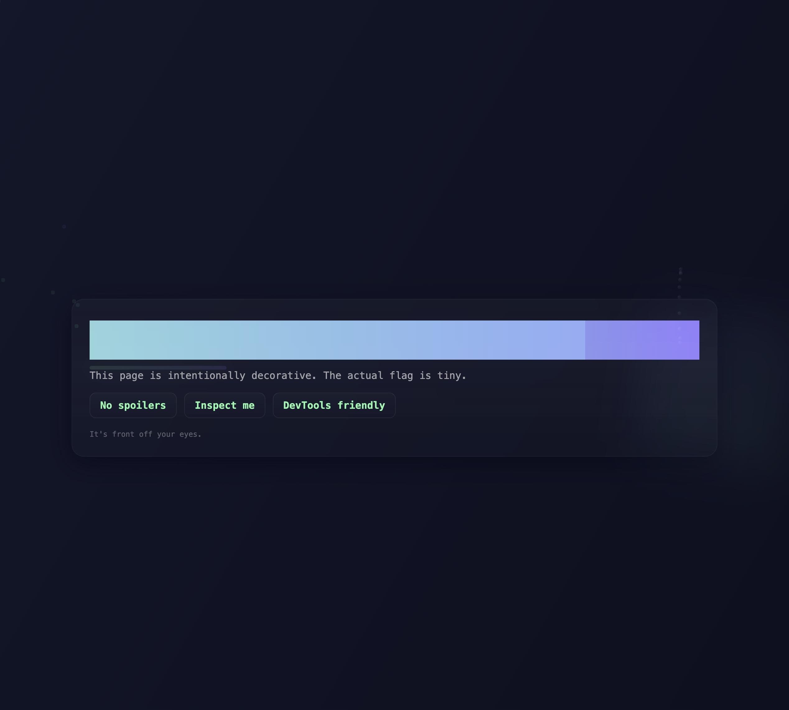
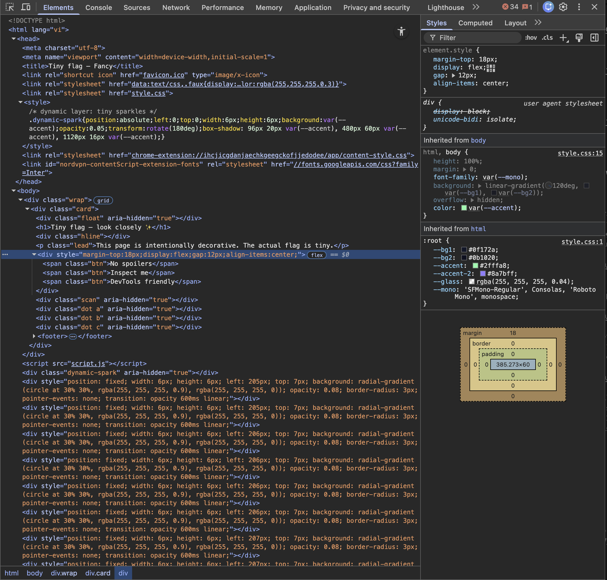
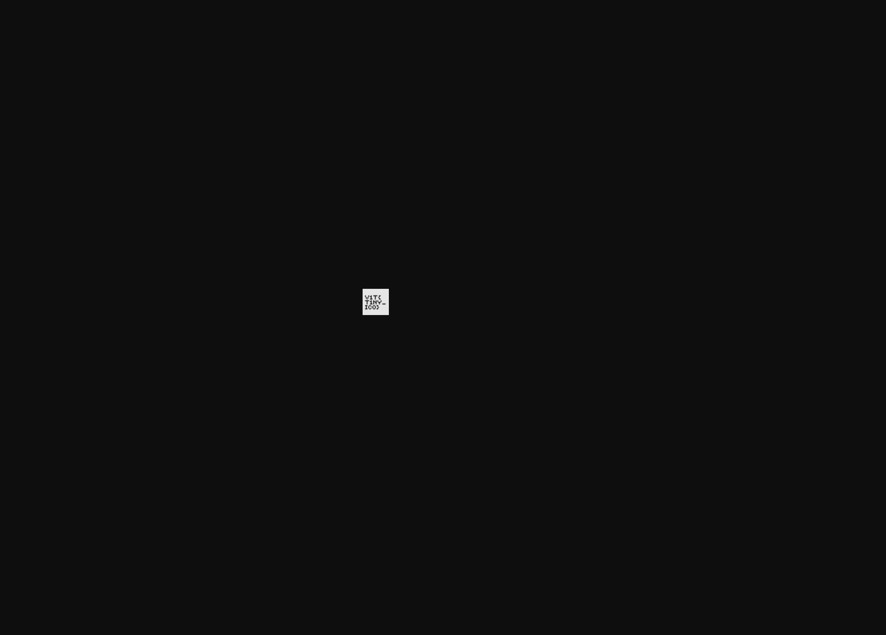
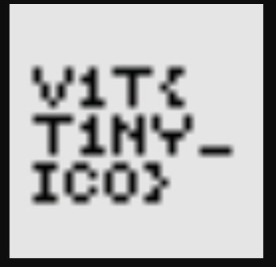

# V1tCTF 2025: Tiny Flag

Author: Duck (Duke) Nguyen (duke7012)

## Description

* Challenge author: unknown
* Category: Web
* Point value: 100

> Do you see the tiny flag :>
> 
> https://tommytheduck.github.io/tiny_flag/

## Tools used

* Google Chrome
    * _Alternative:_ Any browser with the inspection feature.

## Initial Analysis

The website is mostly blank. I tried to highlight the empty space in the middle, and got this text: `Tiny flag — look closely ✨`. However, this text looks normal. I tried some stegnographic decoder, but I just realized that this is a Web challenge, so nothing to do with stegno.

When I look at the website again, I saw the word `Inspect me` in the middle of the website, so I tried to inspect it.

There is nothing seemed weird to me, so I decided to press all the links available in the HTML code, to make sure nothing is hidden in the files. As I pressed to the very first link `favicon.ico`, the website icon file, I saw something weird...

It looks like a text... Let's zoom it in...

No doubt! It's a flag! Quack quack.

## Solution

`v1t{T1NY_ICO}`

## Rating

_**Like**: Cool challenge for Web beginner! Also, MCK is a famous rapper in Vietnam, so if you are interested, you can find more songs from him online :D_
